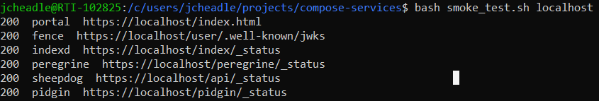
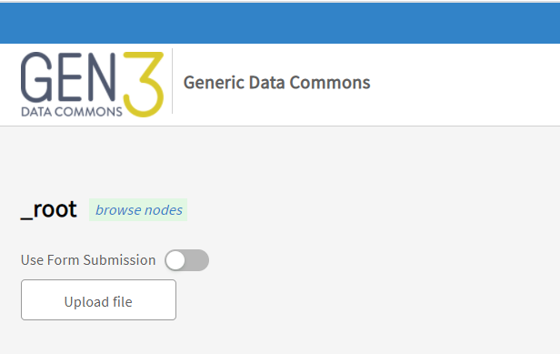
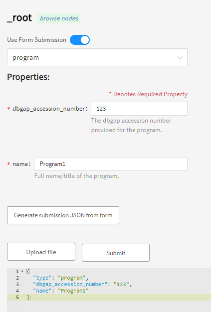
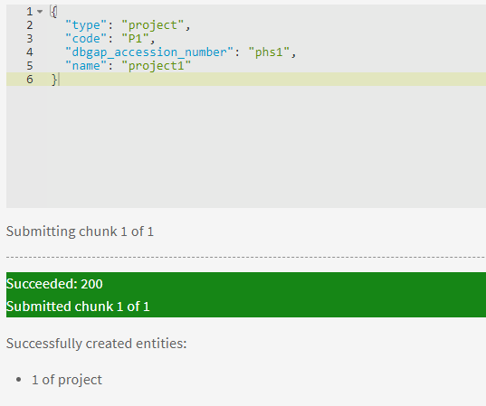
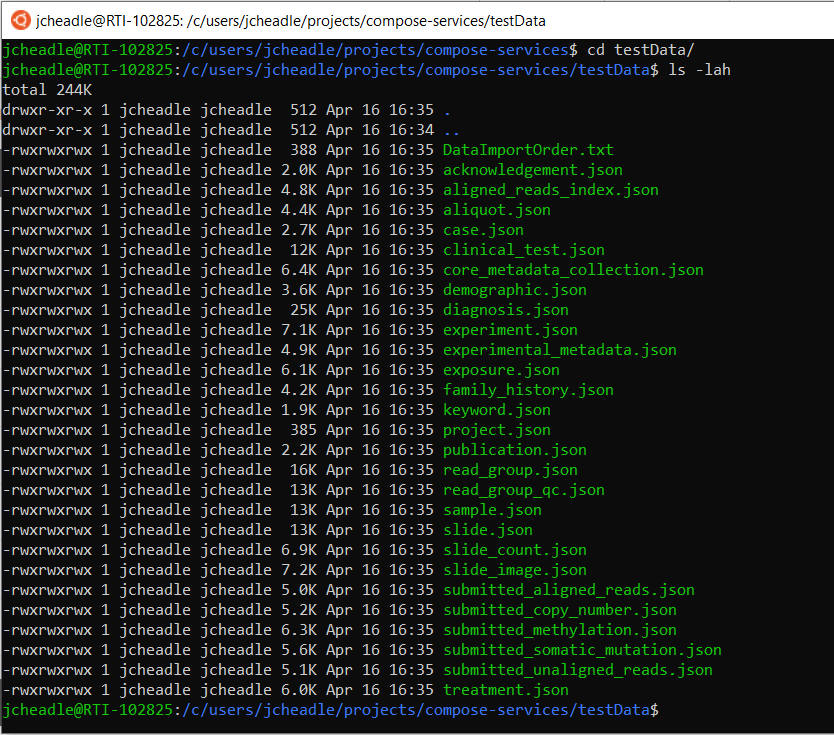
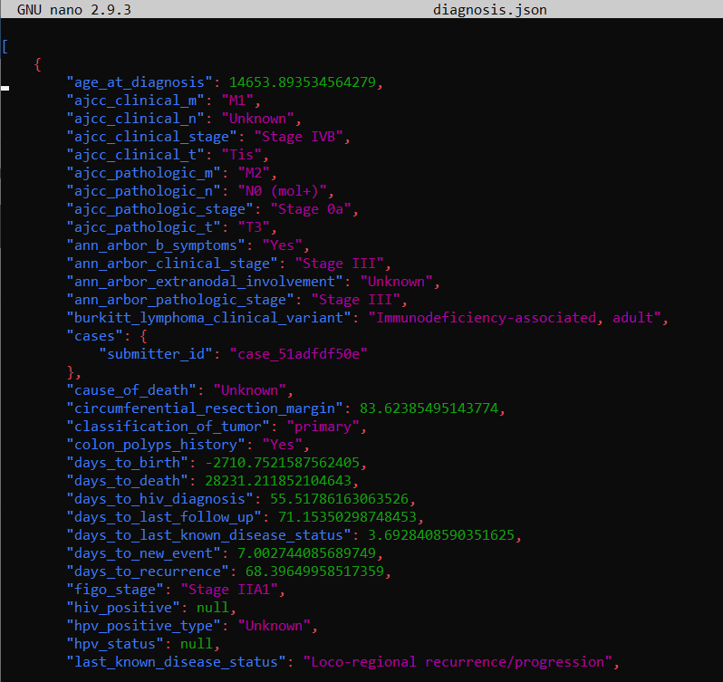
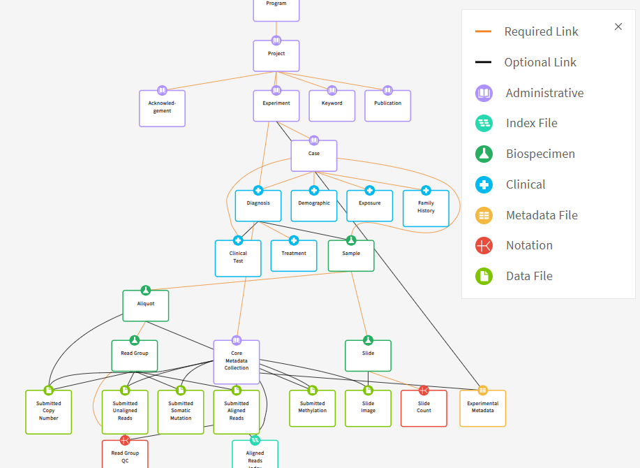
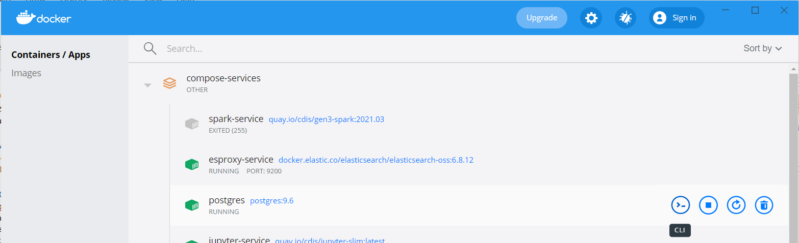

.. _compose_services_working:

Configuring a Working Gen3 Data Commons with Test Data
======================================================

Overview
++++++++

This section continues to walk through the Gen3 `compose-services <https://github.com/uc-cdis/compose-services>`__ repository, 
starting at the `Using the Data Commons <https://github.com/uc-cdis/compose-services#using-the-data-commons>`__ section.  This section assumes that you 
have completed the previous section (:ref:`compose_services_standup`) successfully.

Using the Data Commons
++++++++++++++++++++++

Spin up the Data Commons
------------------------

If you do not have it up already, bring up the docker-compose stack by typing 
:code:`docker-compose up -d` at your project repo root.  Wait until you can 
access the data commons at https://localhost.

Smoke Test
----------

The smoke test script queries the health-check endpoints of each service.
Runt he smoke test by typing :code:`bash smoke_test.sh localhost`.

If any service shows a :code:`500` response (internal server error), log into 
https://localhost using your credentials, refresh the page, and try the smoke 
test again.  You should see :code:`200` responses for each of the services.

Granting Permissions
--------------------

Permissions must be granted to your Admin user for any new programs or projects.
Programs and projects are two required administrative nodes in the Gen3 graph model.  
You can see the Gen3 Graph model visualized at http://localhost/DD.

Definitions
***********

- **Programs**: an organization, e.g. TOPMed.  This is the main upstream node in the Gen3 data model.
- **Projects**: a study, e.g. `NHLBI TOPMed: Genetics Study of Atherosclerosis Risk (GeneSTAR) <https://www.ncbi.nlm.nih.gov/projects/gap/cgi-bin/study.cgi?study_id=phs001218.v2.p1>`__.  This is the node just downstream of a program, but upstream of all other nodes.

For the purposes of this guide, we will use simple demo names for the programs 
and projects.

Permissions
***********

To add data, you must first create a program and project.  However, you must 
first grant yourself access to create see these entities. There is a 
`specific section <https://github.com/uc-cdis/fence/blob/master/docs/user.yaml_guide.md#programs-and-projects-crud-access>`__ 
in the Gen3 compose-services repository that guides you through granting permissions. 
I will go over the highlights below.

First, you must grant the :code:`services.sheepdog-admin` policy to your admin 
user (the one you signed in with) in the **user.yaml** file.

.. image:: images/compose_services_working/user.yaml.jpg
   :width: 600
   :alt: how portions of the user.yaml file connect

These permissions should already be set up, but in case they aren't, make sure 
the appropriate sections look like the figure above (replace the email in 
:code:`groups:users:` with your email).  Exit out of the user.yaml file once 
you are done editing it.

To update user privileges while the docker-compose stack is up, enter the following 
at the command line:

.. code-block:: sh

    docker exec -it fence-service fence-create sync --arborist http://arborist-service --yaml user.yaml

This syncs the user.yaml file with the arborist service, updating user privileges.

Create a Program and a Project
------------------------------

Create a Program
****************

To create a program, visit the URL to your Gen3 Data Commons (most likely https://localhost) 
and append '/_root'.  It should look like the figure below.

Follow the instructions to create a program:

- Click the slider to Use Form Submission
- Select 'program' from the dropdown
- Type in '123' in the :code:`dbgap_accession_number` field
- Type 'Program1' in the :code:`name` field

Alternatively, you could upload a JSON document with these fields.  Then, press 
the 'Submit' button.  If the submission is successful, you can navigate to 
https://localhost/Program1 and see an option to upload more content.

If this does not appear to work, stop the stack and bring it up again with 

.. code-block:: sh

    docker-compose down
    docker-compose up -d

Restarting the stack seems to fix many problems with the local Gen3 deployment.

Create a Project
****************

At https://localhost/Program1, fill in the required fields for the project:

- code: P1
- dbgap_accession_number: phs1 
- name: project1 

Then press 'Submit'.  You should see a confirmation message like below:

Repeat this for a Program named 'Program2' and a corresponding project containing 
the following attributes:

- **code**: P2
- **dbgap_accession_number**: phs2
- **name**: project2

Update Submission Permissions
*****************************

Prior to uploading metadata, you will need to tweak your **Secrets/user.yaml** file so that 
your admin user has permission to view and submit data on the https://localhost/submissions page.

**Add programs to group and/or user**

To upload data to the programs you created, you must add the program names under 
the :code:`policies:` tag in one of your groups *OR* under your user.  I 
recommend adding it to the :code:`data_submitters` group, as this likely aligns 
with production processes (adding access to groups as opposed to individual users). 

.. code-block:: sh
   :emphasize-lines: 8,9

   groups:
   # can CRUD programs and projects and upload data files
   - name: data_submitters
      policies:
      - services.sheepdog-admin
      - data_upload
      - MyFirstProject_submitter
      - Program1
      - Program2
      users:
      - <your_admin_email>@gmail.com

.. code-block:: sh
   :emphasize-lines: 10-11

   users:
    <your_admin_email>@gmail.com:
      tags:
         name: Admin User
         # email: mustbe@differentemail.com
      policies:
      - services.sheepdog-admin
      - workspace
      - data_upload
      - Program1
      - Program2

**Add programs and projects to resources section**

Your programs must be added to :code:`resources/programs` as well.  Follow the example for 
:code:`MyFirstProgram`.

.. code-block:: sh
   :emphasize-lines: 20-29

   resources:
   - name: workspace
   - name: data_file
   - name: services
      subresources:
      - name: sheepdog
         subresources:
         - name: submission
         subresources:
         - name: program
         - name: project
   - name: open
   - name: programs
      subresources:
      - name: MyFirstProgram
         subresources:
         - name: projects
         subresources:
         - name: MyFirstProject
      - name: Program1
         subresources:
         - name: projects
         subresources:
         - name: P1
      - name: Program2
         subresources:
         - name: projects
         subresources:
         - name: P2

**Add programs to policies**

Finally, under the :code:`policies` tag, add the program/project information.

.. code-block:: sh
   :emphasize-lines: 17-39

   policies:
   - id: workspace
    description: be able to use workspace
    resource_paths:
      - /workspace
    role_ids:
    - workspace_user
   - id: data_upload
    description: upload raw data files to S3
    role_ids:
      - file_uploader
    resource_paths:
      - /data_file

   ...

   - id: Program1
    role_ids:
      - reader
      - creator
      - updater
      - deleter
      - storage_reader
      - storage_writer
    resource_paths:
      - /programs/Program1
      - /programs/Program1/projects/P1
   - id: Program2
    role_ids:
      - admin
      - reader
      - creator
      - updater
      - deleter
      - storage_reader
      - storage_writer
    resource_paths:
      - /programs/Program2
      - /programs/Program2/projects/P2

You are now ready to submit test data to these projects.

Upload Test Data
++++++++++++++++

Uploading test data helps you to get a feel for how the data dictionary, data 
explorer page (Windmill), and query page (Guppy) connect.

Generate Test Metadata
----------------------

Gen3 developers use a tool to generate test data that conforms to a particular 
data dictionary.  Currently, the default genomic data commons dictionary is 
active - you can check it by going to https://localhost/DD.

Run the tool at your repository root with the following commands:

.. code-block:: sh

   export TEST_DATA_PATH="$(pwd)/testData"
   mkdir -p "$TEST_DATA_PATH"
   docker run -it -v "${TEST_DATA_PATH}:/mnt/data" --rm --name=dsim 
   --entrypoint=data-simulator quay.io/cdis/data-simulator:master simulate 
   --url https://s3.amazonaws.com/dictionary-artifacts/datadictionary/develop/schema.json 
   --path /mnt/data --program jnkns --project jenkins --max_samples 10

If this is your first time running, this will likely pull a new image to your computer.
After a minute or so, you will see that test data has been generated.

Below is an example of a portion of the **diagnosis.json** file, which shows a 
list of metadata for the properties of the :code:`Diagnosis` node.

Edit Test Metadata
******************

The test metadata generated here is for the project **'Jenkins'**, which does not 
match any of our project names.  Thus, we must change the project name for the 
relevant files, which are as follows:

- acknowledgement.json
- experiment.json
- keyword.json
- publication.json
- core_metadata_collection.json

These files are all at the top of the hierarchy in the data dictionary.

To do this, you may find & replace using your preferred text editor.  You can 
alternatively run the following command at your repo root:

.. code-block:: sh

   find ./testData -type f -name "*.json" | xargs sed -i 's/Jenkins/P1/g'

This command finds every JSON file in the :code:`testData` folder that contains 'Jenkins' 
and replaces it with 'P1', which has been chosen as the project name for Program1 
in this guide.

Upload Test Metadata to Portal
------------------------------

Go to https://localhost/submission to begin upload of test metadata to the Data Portal UI.  
A general guide to this submission is located on `gen3.org's website <https://gen3.org/resources/user/submit-data/>`__.

Upload Order
************

Metadata must be uploaded according to the hierarchy in the graph model. Otherwise, 
you will get a :code:`FAILED: 400` error.  For example, if 'Slide' metadata was 
uploaded prior to uploading the 'Sample' metadata, an error would occur.  Therefore, 
make sure the nodes upstream of the node for which you want to populate metadata is uploaded first:

- Acknowledgement, Experiment, Keyword, Publication
- Case, Core Metadata Collection
- Diagnosis, Demographic, Exposure, Family History
- Clinical Test, Treatment, Sample
- Aliquot, Slide
- Read Group
- Submitted Copy Number, Submitted Unaligned Reads, Submitted Somatic Mutation, Submitted Aligned Reads, Submitted Methylation, Slide Image, Slide Count, Experimental Metadata
- Read Group QC, Aligned Reads Index

You should see the two programs and associated projects that were created in the 
previous steps.  Choose one of the projects - if you replaced 'Jenkins' with 'P1', used Program1-P1 - 
and click the 'Submit Data' button next to it.  Next, click the 'Upload file' 
button and upload the 27 JSON files that are contained within the :code:`./testData` repository.  
This is a bit tedious but should only take a few minutes.

Verify Test Metadata Upload
---------------------------

Data Portal
***********

You may need to bring the docker-compose stack down and up again to see the changes 
in the data portal. (Does Kibana work in Windmill??)

PostgreSQL Database
*******************

Per the compose-services model here, data gets passed to the Postgres database 
for persistence.  We can verify metadata is in the PostgreSQL container by first 
clicking on CLI for the postgres container in Docker Compose, then entering the 
following commands:

code block here

images here

Reconfigure Kibana and Guppy
++++++++++++++++++++++++++++

Reconfigure Kibana
------------------

Reconfigure Guppy
-----------------

Troubleshooting Spark Service
*****************************

Install Dependencies
********************

Verify Guppy Queries Work
-------------------------

Graph Model
***********

Flat Model
**********

Additional Information
**********************

Closing Thoughts
++++++++++++++++

At this point, you *should* have a working data commons with test data that can 
be explored in Data Explorer and queried with Guppy.  The point of the guide up 
to this point is to show the inner workings of Gen3 such that it can be 
customized for the needs of your scientific community.

Future pages in this guide will instruct users on how to customize the look and 
content of their Gen3 deployment and run through a workflow of adding real data 
from publicly available datasets, editing the data dictionary, and performing 
basic analyses in Jupyter Notebooks.
