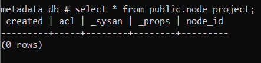
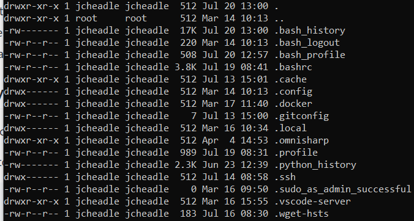
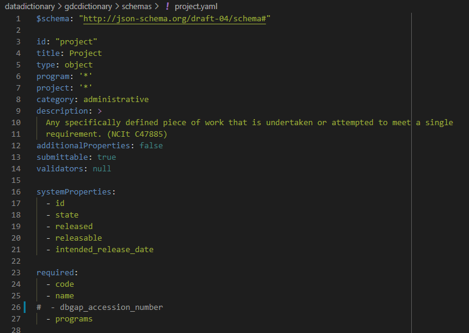
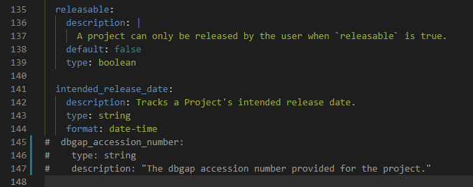
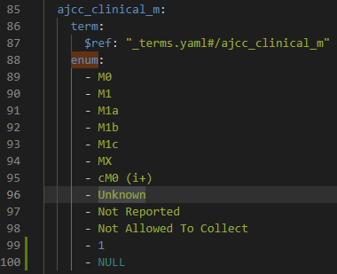

.. _data_dictionary_prep:

Preparing the Data Dictionary for a New Schema
==============================================

Deleting Old Test Data
++++++++++++++++++++++

If you have any old test data, it will useful to delete it.  To do this, following  
the `GitHub guide <https://github.com/uc-cdis/compose-services/blob/master/docs/using_the_commons.md#persistent-store>`__., 
enter the following while your stack is down:

.. code-block:: sh

    docker volume rm compose-services_esdata
    docker volume rm compose-services_psqldata

Double check that in the Postgres database there is no data in, for example, the 
project node:

Validating Existing Dictionary Schema
+++++++++++++++++++++++++++++++++++++

Gen3 has a `repository <https://github.com/uc-cdis/dictionaryutils>`__ for validating 
the Gen3 data dictionaries using JSON Schema.  It can be useful to get this 
installed and ready to use for if and when you create your own custom data dictionary.

Setting up the dictionaryutils Aliases
--------------------------------------

Per the instructions in the GitHub repository, you can make an alias that runs a 
:code:`dictionaryutils` docker container.  This alias is typically stored in a file 
called your '.bash_profile.  First, check to see if you have a file called '.bash_profile' at your home repo:

.. code-block:: sh

    cd ~
    ls -lah

If you don't see '.bash_profile', you can easily create one by typing :code:`touch ~/.bash_profile` 
in the terminal.  To edit the '.bash_profile' file, type :code:`nano ~/.bash_profile` at the terminal.

.. note::

   The example function provided in the GitHub repo, :code:`testdict()`, 
   did not work for me.  I suspect it had something to do with my using WSL.  
   Thus, I created a second function called :code:`testdictwsl()` which overrides the 
   default command of the Dockerfile and substitutes one that seems to work on WSL.  
   I recommend putting both of these in your bash_profile and running whichever 
   one happens to work.

Copy and paste the following code into the file.

.. code-block:: sh

    # if running bash - this ensures your .bashrc will be loaded
    if [ -n "$BASH_VERSION" ]; then
        # include .bashrc if it exists
        if [ -f "$HOME/.bashrc" ]; then
            . "$HOME/.bashrc"
        fi
    fi

    # Gen3 Dictionary Validator Aliases
    testdict() { docker run --rm -v $(pwd):/dictionary quay.io/cdis/dictionaryutils:master; }
    testdictwsl() { docker run --rm -v $(pwd):/dictionary quay.io/cdis/dictionaryutils:master /bin/sh -c 
    "cd /dictionary; rm -rf build dictionaryutils dist gdcdictionary.egg-info; 
    python setup.py install --force && cp -r /dictionaryutils . && cd /dictionary/dictionaryutils; 
    pip uninstall gen3dictionary; nosetests / -s -v; export SUCCESS=$?; cd ..; 
    rm -rf build dictionaryutils dist gdcdictionary.egg-info; exit $SUCCESS"; }

After saving and exiting, source your bash profile with :code:`source ~/.bash_profile`.

Validate the Default Dictionary Schema
--------------------------------------

To validate the default dictionary, move from the compose-services root to the 
:code:`/datadictionary` subfolder.  Source and run :code:`testdict` or :code:`testdictwsl`, 
depending on your system.  See code below:

.. code-block:: sh

    cd datadictionary
    testdictwsl

The first time you run this, your machine may need to download the image from DockerHub.  
This will take several minutes.  After the image is installed and run, you should 
see a long list of tests, with 23 passed tests.  It should look something like the log below::

    test_invalid_files (dictionaryutils.schema_test.SchemaTest) ... ok
    test_schemas (dictionaryutils.schema_test.SchemaTest) ... ok
    test_valid_files (dictionaryutils.schema_test.SchemaTest) ... ok
    test_datamodel.test_datamodel ... ok
    test_required_fields.test_required_nodes ... ok
    test_required_fields.test_required_data_fields ... ok
    test_required_fields.test_required_project_fields ... ok
    test_required_fields.test_required_program_fields ... ok
    test_required_fields.test_required_ubiquitous_fields ... ok
    test_required_fields.test_id_matches ... ok
    When a property is of type "enum", the "type" field should not ... ok
    test_required_fields.test_arrays_have_items ... ok
    If a property is not required, `null` type is automatically ... ok
    test_required_links.test_require_core_metadata_collections ... ok
    test_required_links.test_required_fields_in_links ... ok
    test_required_properties.test_required_program_property ... ok
    test_required_properties.test_required_project_property ... ok
    test_required_properties.test_required_ubiquitous_properties ... ok
    test_required_properties.test_required_internal_properties ... ok
    test_schema_rules.test_no_mixed_type_in_enum ... ok
    test_schema_rules.test_lowercase_ids ... ok
    test_schema_rules.test_nodeid_length ... ok
    test_simulate_data.test ... 
    Validating schemas against metaschema...
    Validating 'Data Release'
    Validating 'Root'
    Validating 'Aliquot'
    Validating 'Read Group QC'
    Validating 'Family History'
    Validating 'Clinical Test'
    Validating 'Publication'
    Validating 'Submitted Somatic Mutation'
    Validating 'Core Metadata Collection'
    Validating 'Keyword'
    Validating 'Slide'
    Validating 'Sample'
    Validating 'Case'
    Validating 'Read Group'
    Validating 'Submitted Aligned Reads'
    Validating 'Demographic'
    Validating 'Aligned Reads Index'
    Validating 'Diagnosis'
    Validating 'Treatment'
    Validating 'Experimental Metadata'
    Validating 'Submitted Methylation'
    Validating 'Exposure'
    Validating 'Program'
    Validating 'Submitted Copy Number'
    Validating 'Slide Image'
    Validating 'Slide Count'
    Validating 'Submitted Unaligned Reads'
    Validating 'Acknowledgement'
    Validating 'Experiment'
    Validating 'Project'
    ok

    ----------------------------------------------------------------------
    Ran 23 tests in 3.549s

    OK

Schema Tests 
++++++++++++

A Note on Schemas
-----------------

The schemas are what drive the data dictionary.  They are located in :code:`./datadictionary/gdcdictionary/schemas`.
They follow JSON Schema convention.  More information can be found in the following repo: https://github.com/NCI-GDC/gdcdatamodel

Before making changes to the data dictionary (:code:`gdcdictionary`),  
**you'll want to copy your old one and rename it** as something else, e.g. 
'gdcdictionary_old' or 'gdcdictionary_copy'  Feel free to do this in a program 
like VS Code (I do most of the programming in VS Code) or just simply in your 
file explorer, or on Linux is fine. 

.. note::

   There appears to be a quirk with Gen3 where the dictionary **MUST** be named 
   :code:`gdcdictionary`.  So, just don't rename it.

.. note::

    If you mess up, you can always move back to your repo root and run 
    :code:`git reset --HEAD`, which will pull down the current version to 
    replace your local version.  This won't affect anything in your :code:`/Secrets` 
    folder, as this is ignored by git via the .gitignore file.

To test the validator, we are going to make changes to the data dictionary that are in violation of the tests.  
The tests can be found in the dictionaryutils GitHub repo mentioned above, specifically 
at `this link <https://github.com/uc-cdis/dictionaryutils/tree/master/tests>`__.

test_required_properties.test_required_project_property
-------------------------------------------------------

Comment out portions of the **project.yaml** file to violate the required property test.  
Specifically, comment out anything having to do with :code:`dbgap_accession_number`, which is a required property.

**Running the test should yield 2 failures**::

    ======================================================================
    FAIL: test_required_fields.test_required_project_fields
    ----------------------------------------------------------------------
    Traceback (most recent call last):
    File "/usr/local/lib/python3.6/site-packages/nose/case.py", line 198, in runTest
        self.test(*self.arg)
    File "/src/tests/test_required_fields.py", line 52, in test_required_project_fields
        assert field in schema["properties"], "{} is required for project".format(field)
    AssertionError: dbgap_accession_number is required for project

    ======================================================================
    FAIL: test_required_properties.test_required_project_property
    ----------------------------------------------------------------------
    Traceback (most recent call last):
    File "/usr/local/lib/python3.6/site-packages/nose/case.py", line 198, in runTest
        self.test(*self.arg)
    File "/src/tests/test_required_properties.py", line 20, in test_required_project_property
        "as required".format(required)
    AssertionError: dbgap_accession_number is required property for a project node, but not defined as required

    ----------------------------------------------------------------------
    Ran 23 tests in 4.104s

    FAILED (failures=2)

Uncomment the **project.yaml** file and run the test again.  You should see everything pass.

test_schema_rules.test_no_mixed_type_in_enum
--------------------------------------------

Find a schema with an enum (enumeration) data type.  I chose **diagnosis.yaml**.  
Under properties, add values that do not share the data type of the enums - 
for instance, I added an integer and a NULL/None type to this enum.

**Running the test should yield 2 failures**::

    [2021-07-28 23:13:00,167][data-simulator simulate][  ERROR] Error: ajcc_clinical_m has mixed datatype. Detail ['M0', 'M1', 'M1a', 'M1b', 'M1c', 'MX', 'cM0 (i+)', 'Unknown', 'Not Reported', 'Not Allowed To Collect', 1, None]
    FAIL

    ======================================================================
    FAIL: test_schema_rules.test_no_mixed_type_in_enum
    ----------------------------------------------------------------------
    Traceback (most recent call last):
    File "/usr/local/lib/python3.6/site-packages/nose/case.py", line 198, in runTest
        self.test(*self.arg)
    File "/src/tests/test_schema_rules.py", line 20, in test_no_mixed_type_in_enum
        ), "{}: enum values should all be string".format(schema["id"])
    AssertionError: diagnosis: enum values should all be string

    ======================================================================
    FAIL: test_simulate_data.test
    ----------------------------------------------------------------------
    Traceback (most recent call last):
    File "/usr/local/lib/python3.6/site-packages/nose/case.py", line 198, in runTest
        self.test(*self.arg)
    File "/src/tests/test_simulate_data.py", line 9, in test
        assert graph.graph_validation()
    AssertionError

    ----------------------------------------------------------------------
    Ran 23 tests in 3.877s

    FAILED (failures=2)

Reverse the changes, save, re-run the tests, and ensure the tests pass.

Making Changes to the Data Dictionary
+++++++++++++++++++++++++++++++++++++

Now that you have established that the automated tests respond to the data dictionary 
structure, you may begin making changes to the data dictionary.  See 
`this link <https://github.com/uc-cdis/compose-services/blob/master/docs/using_the_commons.md#changing-the-data-dictionary>`__ 
for tips on how to edit the data dictionary.