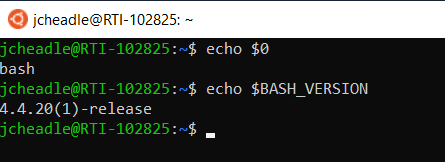

.. _prerequisites:

Prequisites
===========

Overview
++++++++

This guide is written specifically for Windows users, specifically running 
Windows Subsystem for Linux (WSL).  Users with other operating systems 
(macOS, Linux) *should* be able to follow along with this guide well, 
ignoring Windows-specific instructions where appropriate.

The following is a synthesis of publicly-available documentation designed to 
get users up and running with the infrastructure needed to deploy Gen3 locally 
on a Windows machine.  In this section we cover the following topics:

- :ref:`installing_wsl`
- :ref:`installing_linux`
- :ref:`installing_bash`
- :ref:`docker_desktop`

We also cover other considerations for Gen3 deployment on a local machine, 
such as settings and disk drive space needed.

.. _installing_wsl:

Installing WSL
++++++++++++++

This section will walk through installation of WSL.  Windows provides very 
thorough `documentation <https://docs.microsoft.com/en-us/windows/wsl/>`__, 
which will be worked through in this section.   At 
the time of writing there are two versions of WSL - WSL 1 and WSL 2.  You can 
explore the differences between these versions in a subsection of this guide, 
located `here <https://docs.microsoft.com/en-us/windows/wsl/compare-versions>`__.  
While WSL 2 is desirable because it is faster than WSL 1, 
**I recommend WSL 1 for this guide.**  At the time of writing, the WSL 2 
back end for Docker requires disabling of a McAfee feature to run properly, 
which is a potential security threat.  I will still go over how to enable 
WSL 2 in this guide.

Checking Windows Version
------------------------

All employees at RTI should have a version of Windows 10 that will accommodate 
WSL.  To ensure that this is the case, check your Windows version by opening 
the command prompt (click the search bar, type in :code:`cmd`).  
Once at the command prompt, type in :code:`winver` and press enter.  Windows OS 
information will appear in a pop-up.

To install WSL 2, the OS version must be greater or equal to 1903, 
and the build must be 18362 or higher.  If it is lower than that, you can 
use WSL1.  WSL is not supported for builds lower than 18362. 

Installing WSL for the First Time (WSL 1)
-----------------------------------------

This subsection follows the `Manual Installation Steps <https://docs.microsoft.com/en-us/windows/wsl/install-win10#manual-installation-steps>`__ 
to install WSL for the first time.

Open Windows PowerShell as an Administrator and run the following command:

.. code-block:: sh

    dism.exe /online /enable-feature /featurename:Microsoft-Windows-Subsystem-Linux /all /norestart

.. image:: images/prerequisites/enable_wsl.png
   :width: 600
   :alt: A screencap of the PowerShell Terminal

This will only take a few seconds to install.

.. note::

    If running this command doesn't seem to do anything, it's possible Windows 
    already has Windows Subsystem for Linux Enabled.  To check, navigate to 
    Windows Settings, then find 'Programs and Features' under the Related 
    settings header on the right side of the screen.  In the left pane, click 
    on the hyperlink to 'Turn Windows features on or off', then navigate all the 
    way down until you see **Windows Subsystem for Linux**, and verify the box is 
    checked.

If you are interested in upgrading to WSL2 from WSL1, continue with the section 
below.  Otherwise, continue to the :ref:`installing_linux` section.

Upgrading to WSL 2
------------------

Before installing WSL 2, enable the Virtual Machine Platform optional feature 
by running the following command:

.. code-block:: sh

    dism.exe /online /enable-feature /featurename:VirtualMachinePlatform /all /norestart

.. image:: images/prerequisites/enable_vmp.png
   :width: 600
   :alt: A screencap of the PowerShell Terminal - enable Virtual Machine Platform

This will only take a few seconds to install.

.. note::

    If running this command doesn't seem to do anything, it's possible Windows 
    already has Windows Subsystem for Linux Enabled.  To check, navigate to 
    Windows Settings, then find 'Programs and Features' under the Related 
    settings header on the right side of the screen.  In the left pane, click 
    on the hyperlink to 'Turn Windows features on or off', then navigate all the 
    way down until you see **Virtual Machine Platform**, and verify the box is 
    checked.

.. image:: images/prerequisites/windows_features_vmp.png
   :width: 400
   :alt: A screencap of the Windows Features dialogue box

Next, download the `latest WSL2 package <https://wslstorestorage.blob.core.windows.net/wslblob/wsl_update_x64.msi>`__ 
and run the installation.

.. note::

     If you get an 'access denied' message when trying to run this command, 
     open PowerShell *without* Admin Access (i.e. just your normal user).

.. _installing_linux:

Installing a Linux Distribution
+++++++++++++++++++++++++++++++

Open the Microsoft Store to download a Linux distribution.  
I recommend one of the Ubuntu distributions, either 18.04 or 20.04, 
which come with bash pre-installed.
- `Ubuntu 18.04 LTS <https://www.microsoft.com/store/apps/9N9TNGVNDL3Q>`__
- `Ubuntu 20.04 LTS <https://www.microsoft.com/store/apps/9n6svws3rx71>`__

Launching for the First Time
----------------------------

Upon launching a Linux distribution (e.g. Ubuntu 18.04 LTS) for the first time, 
files will be unzipped and you will be prompted for a UNIX username and password.  
Once complete, you will see the default bash prompt:

.. code-block:: sh

    <username>@<hostname>:~$

.. image:: images/prerequisites/install_bash.png
   :width: 600
   :alt: A screencap of bash installing

.. image:: images/prerequisites/bash_prompt.png
   :width: 400
   :alt: A screencap of the bash prompt

Check your Distribution(s)
--------------------------

To check the Linux distributions on your windows machine, open PowerShell 
(not as an Administrator) and type :code:`wsl -l -v`, which means 
'list all distributions in a verbose way'.  An example below shows two 
Linux distributions.

.. image:: images/prerequisites/linux_distros.png
   :width: 600
   :alt: A screencap of available linux distros

Change your WSL Version
-----------------------

If for some reason you want or need to change your WSL version in your 
Linux distro, the command is :code:`wsl --set-version <Distro> <Version>`.  
For example, below I've changed the WSL Version of Ubuntu-18.04 to WSL 1.

.. image:: images/prerequisites/linux_versions.png
   :width: 600
   :alt: A screencap showing the linux version change

.. _installing_bash:

Installing Bash
+++++++++++++++

Bash is a text-based shell and command language.  Bash should be included within 
any Linux Distribution that was installed, e.g. Ubuntu.  If it is not, navigate 
to the `gnu.org <https://www.gnu.org/software/bash/manual/html_node/Installing-Bash.html>`__ site 
to learn how to install Bash on the Linux distribution you downloaded.

To check whether you are using Bash in your Linux Distribution, type 
:code:`echo $0` at the command prompt, which tells you the name of the 
running process.  It should return 'bash' or something similar if you are 
currently running Bash.  Alternatively, you could type 
:code:`echo $BASH_VERSION`  to understand which version of Bash you are running.

.. _docker_desktop:

Installing Docker Desktop for Windows
+++++++++++++++++++++++++++++++++++++

As alluded to in the beginning of this document, the installation details for 
Docker Desktop for Windows are different depending on whether you are using 
WSL 1 or WSL 2, so I detail both these approaches below.

Installing Docker
-----------------

Following along with the `Docker documentation <https://docs.docker.com/docker-for-windows/install/>`__, 
Download Docker from `Docker Hub <https://hub.docker.com/editions/community/docker-ce-desktop-windows/>`__.  
Run the downloaded executable (Version 3.1.0 at time of writing).
If prompted, ensure the :code:`Enable Hyper-V Windows Features` option is 
selected on the configuration page.

.. note::

   if you already have an older version of docker installed and need to perform 
   an **uninstall** of your current version, open task manager as an Administrator and 
   end the :code:`Docker.Service` task.

   In PowerShell with Admin mode enabled, type the following at the command prompt:

    .. code-block:: sh

        & "C:\Program Files\Docker\Docker\Docker Desktop Installer.exe" uninstall  

   The uninstall will take a few minutes.  Then, from a PowerShell terminal,
   unregister the docker distros (if they exist) using :code:`wsl --unregister <distro_name>`.
   Afterwards, restart your computer, and perform a fresh install of Docker 
   from the previously-downloaded installer.

.. _docker_backend:

Changing the Docker Backend
---------------------------

When writing this guide, I encountered a problem in which Docker would not 
start with the WSL 2 back end enabled.  The reason why will be covered in the 
WSL section, but if you encounter this issue on a fresh install, there is a 
simple fix to prevent this issue.

First, navigate to the following path: :code:`C:\Users\your windows username\AppData\Roaming\Docker`
and replace :code:`your windows username` with your user name, e.g. jcheadle.
Second, find the settings.json file, and set the following line from true to false: 

.. code-block:: yaml
    
    "wslEngineEnabled": false

Upon restarting the program, Docker will start with the Hyper-V backend.

Docker Desktop Hyper-V Backend (WSL 1)
--------------------------------------

An excellent guide to getting Docker Desktop to work with the Hyper-V backend and 
WSL is linked `here <https://nickjanetakis.com/blog/setting-up-docker-for-windows-and-wsl-to-work-flawlessly>`__.
I'll paraphrase the steps needed below.

If necessary, set the WSL 2 backend to 'false' so that Docker Desktop does not
hang upon start up (described above in :ref:`docker_backend`).

Double-click Docker Desktop to start it up.  If it prompts you to use WSL 2, 
just choose the 'not now' option.  Once started (this should take about a minute), 
navigate to 'settings' and check 'Expose daemon on tcp://localhost:2375 without TLS'.  
Then click 'Apply' & restart Docker Desktop.

.. image:: images/prerequisites/docker_desktop_settings.png
   :width: 600
   :alt: A screencap of Docker Desktop settings

Install Docker and Docker Compose in your WSL 1 Linux Distribution
******************************************************************

**Install Docker and other Linux Components**

Run the following commands in your terminal:

.. code-block:: sh
    
    # Update the apt package list.
    sudo apt-get update -y
    # Install Docker's package dependencies.
    sudo apt-get install -y \
    apt-transport-https \
    ca-certificates \
    curl \
    software-properties-common
    # Download and add Docker's official public PGP key.
    curl -fsSL https://download.docker.com/linux/ubuntu/gpg | sudo apt-key add -
    # Verify the fingerprint.
    sudo apt-key fingerprint 0EBFCD88
    # Add the `stable` channel's Docker upstream repository.
    #
    # If you want to live on the edge, you can change "stable" below to "test" or
    # "nightly". I highly recommend sticking with stable!
    sudo add-apt-repository \
    "deb [arch=amd64] https://download.docker.com/linux/ubuntu \
    $(lsb_release -cs) \
    stable"
    # Update the apt package list (for the new apt repo).
    sudo apt-get update -y
    # Install the latest version of Docker CE.
    sudo apt-get install -y docker-ce
    # Allow your user to access the Docker CLI without needing root access.
    sudo usermod -aG docker $USER

These commands should take several minutes to run.

**Install Docker Compose**

Run the following commands in your terminal:

.. code-block:: sh
    
    # Install Python 3 and PIP.
    sudo apt-get install -y python3 python3-pip
    # Also upgrade pip - 
    pip3 install --upgrade pip
    # Install Docker Compose into your user's home directory.
    pip3 install --user docker-compose

Configure Paths
***************

**Make sure $HOME/.local/bin is set on your WSL $PATH**.  Open your profile path 
by entering the following at the Linux command prompt: 

.. code-block:: sh
    
    nano ~./profile

Anywhere on a new line (I entered it at the bottom), add the following: 

.. code-block:: sh
    
    export PATH="$PATH:$HOME/.local/bin" 
    
Then save the file.  Enter :code:`echo $PATH` at the command prompt, and confirm
that :code:`$HOME/.local/bin` is there.  For me, :code:`$HOME` resolves to 
:code:`/home/jcheadle`.

.. image:: images/prerequisites/pythonpath.png
   :width: 600
   :alt: A screencap of $PATH variable

Check Settings
**************

**Check that Docker & Docker Compose work**

.. code-block:: sh
    
    # You should get a bunch of output about your Docker daemon.
    # If you get a permission denied error, close + open your terminal and try again.
    docker info
    # You should get back your Docker Compose version.
    docker-compose --version

**Ensure Volume Mounts Work**

There is a mismatch of expectations for file paths between Docker and WSL.  
Docker expects a path like :code:`/c/Users/<your Windows username>`, whereas 
WSL expects a path like :code:`/mnt/c/Users/<your Windows username>`.  The 
solution lies in configuring the **wsl.conf** file.  At the Linux command prompt,
enter the following:

.. code-block:: sh
    
    sudo nano /etc/wsl.conf
    # Now make it look like this and save the file when you're done:
    [automount]
    root = /
    options = "metadata"

Fully restart your computer for this change to take effect.  Then, test with a 
Linux command on wsl, such as :code:`ls -lah /c/users` (normally this would fail 
as you would need to preface the file path with /mnt) to ensure the setting
change took effect.

Docker Desktop WSL 2 Backend
----------------------------

To enable Docker to work with WSL2, follow the guide `here <https://docs.docker.com/docker-for-windows/wsl/>`__.  
Using Docker with WSL 2 as opposed to WSL 1 increases speed and improves 
resource consumption.

Disable McAfee Access Protection
********************************

In my experience, it was required to disable the **Threat Prevention -> Enable Access Protection** setting in McAfee.  
Note that you should contact GTS or your IT Strategies Team Leader in case you 
need a risk waiver prior to making this setting change.

Run Docker Desktop for Windows, then navigate to **Settings -> General** and 
check the box for **'Use the WSL 2 based engine'**.  Then click **'Apply & Restart'.**  
This step may take several minutes.

After the Docker container has restarted, it may prompt for enabling integration 
with WSL2 distros.  Here, ensure that your target distro is enabled.  If Docker 
does not prompt you to do this, go to **Settings -> Resources -> WSL Integration** 
to click the slider.  In the example below, I have Ubuntu-20.04 enabled.  Then click 
**'Apply & Restart'** again.

To test, navigate to your WSL 2 distro and enter :code:`docker info` at the
command prompt like before.

Other Considerations
++++++++++++++++++++

Docker Memory Settings
----------------------

In Docker Desktop, under **Settings -> Resources**, set the memory to at least 6 GB.

Docker Group Membership
-----------------------

At the Linux command prompt for your distro, enter the following: 

.. code-block:: sh

    sudo usermod -aG docker your-user 

in which :code:`your-user` is the username you chose for this Linux distro. Enter 
:code:`groups` at the command prompt to ensure docker shows up.  See example below:

.. image:: images/prerequisites/docker_group.png
   :width: 600
   :alt: A screencap of Docker group membership

Disk Drive Space
----------------

On your local disk drive, keep roughly 20-30 GB free for data and programs to 
be used in this project.

GitHub Credentials
------------------

The rest of this guide assumes you are familiar with GitHub and have an account.  
If not, familiarize yourself with the `GitHub documentation <https://docs.github.com/en/github/getting-started-with-github/signing-up-for-github/signing-up-for-a-new-github-account>`__.

Resources
+++++++++

1. `Windows Subsystem for Linux Documentation <https://docs.microsoft.com/en-us/windows/wsl/>`__
2. `Comparing WSL Versions <https://docs.microsoft.com/en-us/windows/wsl/compare-versions>`__
3. `Installing Bash <https://www.gnu.org/software/bash/manual/html_node/Installing-Bash.html>`__
4. `Installing Docker Desktop for Windows <https://docs.docker.com/docker-for-windows/install/>`__
5. `Docker Desktop WSL 2 Backend <https://docs.docker.com/docker-for-windows/wsl/>`__
6. `Docker Desktop WSL 1 Setup Guide <https://nickjanetakis.com/blog/setting-up-docker-for-windows-and-wsl-to-work-flawlessly>`__

